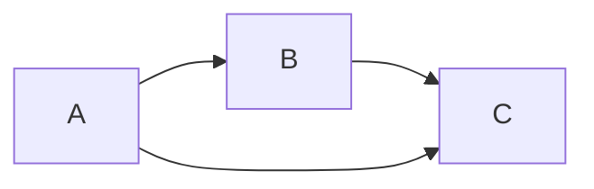
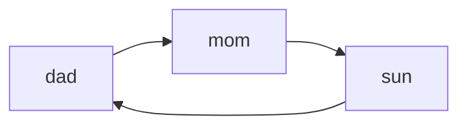
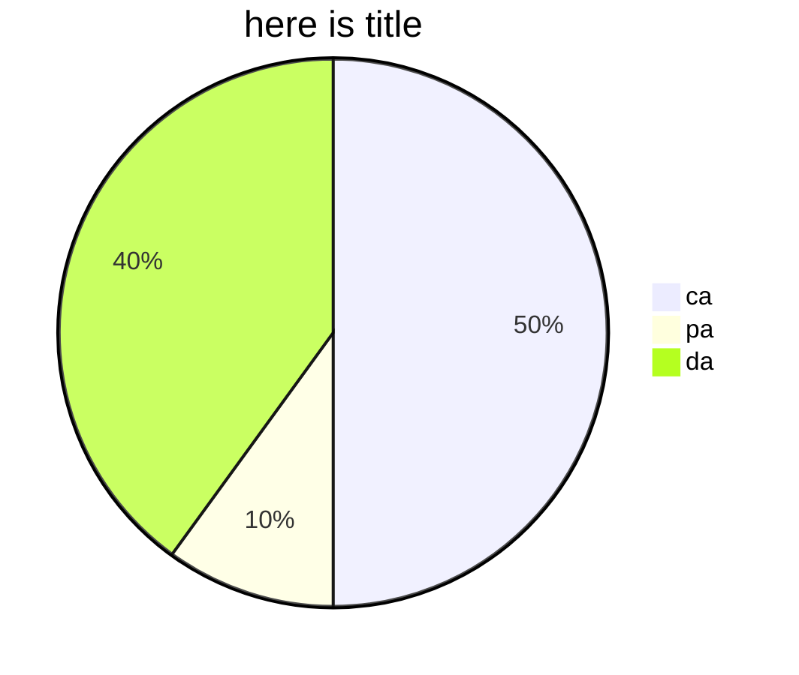
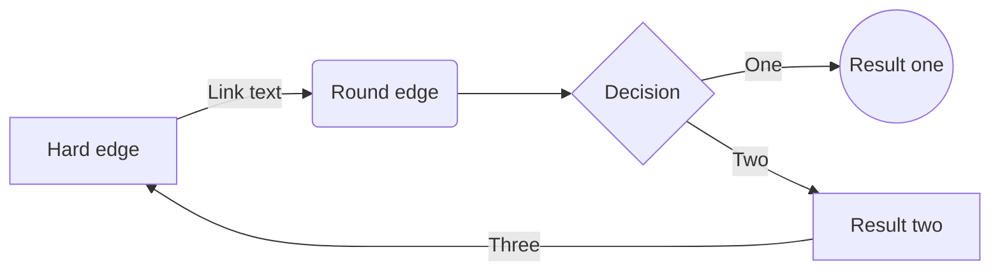
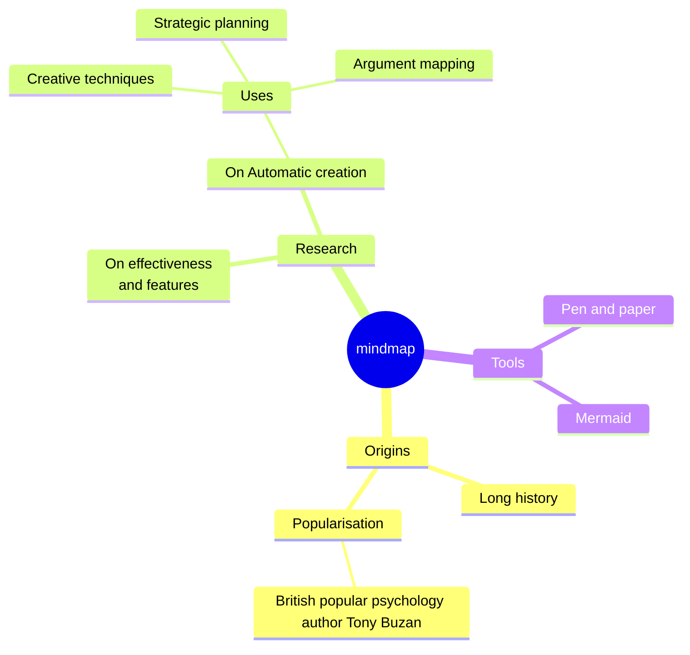
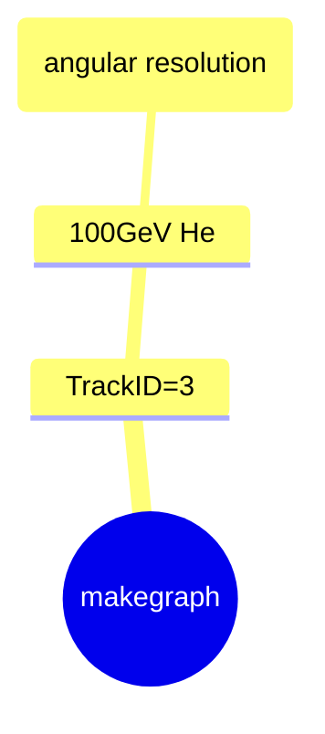

## 20231206
---

  
- [x] 选项一
- [ ] 选项二
- [ ]  [链接](https://www.baidu.com)  

First Term
: This is the definition of the first term.  
Second Term
: This is one definition of the second term.
: This is another definition of the second term.
| Syntax      | Description |
| ----------- | ----------- |
| Header      | Title       |
| Paragraph   | Text        |  

| Syntax      | Description | Test Text     |
| :---        |    :----:   |          ---: |
| Header      | Title       | Here's this   |
| Paragraph   | Text        | And more      |
||||

$$
d^{i-1} u^{(j-1)-(i-1)} S_0=u^{j-i} d^{i-1} S_0
$$










: dame:🤓


### 真正的笔记



##### 带电粒子物理量计算

* 在同一个能量的文件（一个文件）计算角分辨率  

* label取值 trackID=3 原初粒子 带电的事例的话 应该只考虑这个

* <font color=red>方向是不是也需要区别开？**~~输入训练就应该是有区别的？~~**不区别 **可以验证的时候区别**

  ---

 #####  NiN网络学习--李沐

#####   1*1的卷积替代全连接  

在卷积神经网络（CNN）中，全连接层（fully connected layers）和 \(1 \times 1\) 的卷积层（\(1 \times 1\) convolutional layers）在某些情况下可以实现相同的功能，但它们在实现和效果上有一些细微的区别。让我们来解释这两种结构的相似性和差异：

### 相似性

1. **线性变换**：全连接层和 \(1 \times 1\) 的卷积层都执行线性变换。在全连接层中，这通过矩阵乘法实现；在 \(1 \times 1\) 的卷积层中，这通过卷积操作实现，但由于卷积核很小，它实际上等同于对每个像素点进行独立的线性变换。

2. **参数量**：对于给定数量的输入和输出通道，\(1 \times 1\) 的卷积核的参数量与全连接层的参数量相同。

3. **作用**：在某些情况下，两者可以互换使用。例如，如果输入是一个 \(1 \times 1\) 的特征图（feature map），那么 \(1 \times 1\) 卷积和全连接层将具有相同的效果，因为只有一个空间位置。

### 差异

1. **空间信息**：全连接层不保留空间信息，它将输入特征图展平为一个一维向量。相比之下，\(1 \times 1\) 卷积保持了输入的空间维度，因此在进行操作时，它能够保留空间信息。

2. **参数共享**：在 \(1 \times 1\) 卷积中，相同的卷积核在整个输入特征图上共享，这有助于减少模型的参数量并提高效率。全连接层则没有这种参数共享机制。

3. **适应不同大小的输入**：\(1 \times 1\) 卷积可以应用于任何大小的输入特征图，而全连接层需要固定大小的输入。

4. **作用域**：\(1 \times 1\) 卷积的作用局限于逐通道地处理像素，而全连接层则可以学习输入特征之间更复杂的关系。

### 应用上的考虑

- **网络深度**：在深度学习中，\(1 \times 1\) 卷积通常用于构建更深的网络，例如在Inception网络中用于降维（减少通道数）和增加非线性。

- **计算效率**：\(1 \times 1\) 卷积通常比全连接层更计算高效，特别是在处理大型特征图时。

总结来说，虽然在特定情况下全连接层和 \(1 \times 1\) 的卷积层可以实现类似的功能，它们在实现机制、参数共享、空间信息保留等方面存在差异。在实际应用中，选择哪种类型的层取决于特定任务的需求和网络的整体架构。

  全连接层（Fully Connected Layer，FC层）是神经网络中的一种层，它的每一个神经元都与前一层的所有神经元相连接。这种层通常用于神经网络的最后几层，用于整合学习到的特征并进行最终的决策（如分类或回归）。下面是全连接层的一些基本要点：

  ###### 工作原理

  1. **输入**: 全连接层的输入通常是一个一维的特征向量。如果前一层是卷积层或池化层，那么其输出通常需要被“展平”（Flatten）为一维向量。

  2. **权重矩阵**: 每个全连接层都有一个权重矩阵。这个矩阵的行数等于输入特征的数量，列数等于该层神经元的数量。

  3. **偏置**: 每个神经元都有一个偏置项。

  4. **激活函数**: 全连接层通常会使用激活函数（如ReLU、Sigmoid或Tanh）来引入非线性。

  ###### 数学表示

  如果用 \( \mathbf{x} \) 表示输入向量，\( \mathbf{W} \) 表示权重矩阵，\( \mathbf{b} \) 表示偏置向量，那么全连接层的输出 \( \mathbf{y} \) 可以表示为：

$$
  \mathbf{y}=f(\mathbf{W} \mathbf{x}+\mathbf{b})
$$
  其中 \( f \) 是激活函数。

  ###### 在神经网络中的应用

  - 在卷积神经网络（CNN）中，全连接层通常位于几层卷积层和池化层之后，用于基于提取的特征进行最终的分类或回归。

  - 在传统的多层感知器（MLP）中，网络可能完全由全连接层构成。

  ###### 编码实现

  在像PyTorch或TensorFlow这样的深度学习框架中，创建一个全连接层相当直接。例如，在PyTorch中，你可以使用 `nn.Linear` 来创建一个全连接层：

  ```python
  import torch.nn as nn
  
  # 创建一个全连接层，输入特征数量为 input_features，输出特征数量为 output_features
  fc = nn.Linear(input_features, output_features)
  ```

  在TensorFlow和Keras中，你可以使用 `tf.keras.layers.Dense`：

  ```python
  from tensorflow.keras.layers import Dense
  
  # 创建一个全连接层，输出特征数量为 units
  dense = Dense(units, activation='relu')  # 可以指定激活函数
  ```

  在使用这些层时，你只需要定义输入和输出的特征数量，框架会自动处理权重和偏置的初始化以及前向传播的细节。对于全连接层：

  - **输入**：如果输入是多通道的（例如，来自卷积层的多个特征图），通常会将这些特征图“展平”（flatten）为一个一维向量。这意味着，如果你有 CC 个通道，每个通道有 H×WH×W 的尺寸，那么展平后的向量长度将是 C×H×WC×H×W。

  - **权重矩阵**：在这种情况下，全连接层的权重矩阵 WW 的维度将是 N×(C×H×W)N×(C×H×W)，其中 NN 是输出特征（或神经元）的数量。

  - **输出**：输出将是一个 NN 维的向量，每个维度对应于一个输出特征。

    NiN与VGG相比只是减少了参数

---

###### BN

<font size=5>全连接的特征就是
$$
\mathbf{y}=f(\mathbf{W} \mathbf{x}+\mathbf{b})
$$
BN最后其实就是小批量的正态分布了样本 可以加速收敛速度 不改变模型精度  

很明显需要在每一层加入BN

