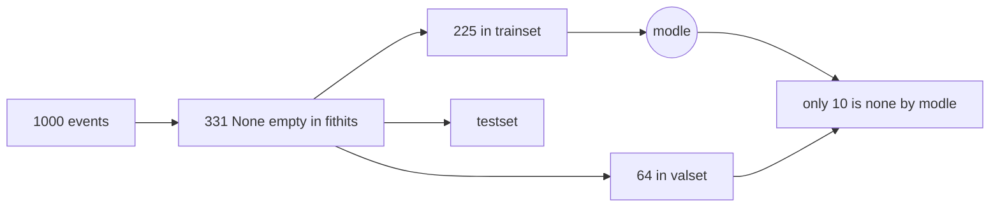

# 20231220

---

## DGL

```mermaid
graph LR
	A[1000 events]-->B[331 None empty in fithits] --> C[64 in valset]
    B-->D[225 in trainset]-->F((modle))-->E
    C-->E[only 10 is none by modle]
	B-->G[testset]
```

按照event数 --> 输出模型的pred 与自己挑选的比较

<>pred是什么?

